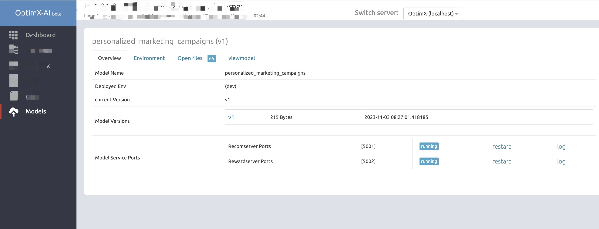

# OptimX-AI

[](https://img.shields.io/badge/leepand%2FOptimX-AI)
[](https://img.shields.io/github/license/leepand/OptimX-AI)

OptimX-AI 是一个用于在线（online）强化学习（RL）模型的轻量级 MLOps，主要使用由[MLOpsKit](https://github.com/leepand/mini-mlops)提供的技术。

* [Features](#features)
* [Installation](#installation)
* [Getting started](#getting-started)
* [Configuration](#configuration)
* [Screenshots](#screenshots)
* [License](#license)


## Features

OptimX-AI是一个用于开发、部署和维护在线强化学习模型的框架。它支持实时更新模型，即在接收到反馈时立即更新模型，并在下一个请求中使用新的模型。在这个框架中，我们的应用场景主要使用小型模型，为每个用户构建独立的模型，并通过交互和优化来不断改进模型的决策能力。

✔ [*总览（Dashboard）*](https://www.github.com) • 系统的仪表板概述，显示 cpu、磁盘、网络、用户、内存、交换和模型数据。

✔ *多节点/集群* • 支持多个代理节点，这些节点要么由配置指定，要么在启动时将自身注册到运行 Web 界面的公共 optimx 节点。

✔ *Online-first* • 专为在线机器学习模型而设计，同时也支持批处理模型。

✔ *简洁优先* • 鼓励您使用SQL 处理数据并使用Python 定义模型。

✔ *自动更新* • 所有数据自动更新，无需刷新

✔ *日志监控* • 支持查看最新和搜索日志。日志按模式（如/var/log/*.log）添加，定期检查以说明新文件或已删除文件。

## Installation

请确保您的系统能够构建Python C扩展。在Debian派生的发行版，如Ubuntu，可以使用`apt-get`命令安装`build-essential`和`python-dev`软件包：

`# apt-get install build-essential python-dev`

而在RHEL（Fedora，CentOS等）发行版上：

```
# yum groupinstall "Development Tools"
# yum install python-devel
```

Installation using pip:<br>
`$ pip install .`

## Getting started

启动 optimx:<br>
`$ optimx`

使用 optimx agent:<br>
`$ optimx -a --register-to [http|https]://[host]:[port] --register-as my-agent-node`

这将以代理模式启动optimx，并尝试将节点注册到由`--register-to`选项指定的主optimx节点。当以代理模式启动optimx时，它会作为一个代理节点运行，并尝试将自己注册到主optimx节点上。这种模式允许将多个optimx节点连接到一个主节点，以实现集中化的监控和管理。

通过使用--register-to选项，您可以指定主optimx节点的地址，以便代理节点可以将自己注册到该主节点。一旦代理节点成功注册，它将与主节点建立连接，并向主节点汇报其状态和信息。主节点可以收集和展示所有注册的代理节点的数据，并提供集中化的监控和管理功能。

代理模式对于在分布式环境中部署optimx非常有用。通过将多个代理节点连接到一个主节点，您可以方便地监控和管理整个集群的状态和性能。这种架构还允许水平扩展，以适应不断增长的节点数量。

要成功使用代理模式，请确保主optimx节点已正确配置，并可以接受来自代理节点的注册请求。同时，代理节点需要正确指定--register-to选项，以确保连接到正确的主节点。

当以代理模式启动时，代理节点将在主机和端口上设置一个RPC服务器，而不是Web服务器。主机和端口分别由`-p/--port`和`-b/--bind`选项指定。

主 optimx 节点（提供HTTP服务）将显示可供切换的注册节点列表。

以下是可用的命令行参数（command-line arguments）：

```
$ optimx --help
usage: optimx [-h] [-l path] [-b host] [-p port] [-d] [-a]
              [--register-to host:port] [--register-as name]

optimx [version] - mlops information web dashboard

optional arguments:
  -h, --help            show this help message and exit
  -l path, --log path   log files to make available for optimx. Patterns (e.g.
                        /var/log/**/*.log) are supported. This option can be
                        used multiple times.
  -b host, --bind host  host to bind to. Defaults to 0.0.0.0 (all interfaces).
  -p port, --port port  port to listen on. Defaults to 5000.
  -d, --debug           enables debug mode.
  -a, --agent           Enables agent mode. This launches a RPC server, using
                        zerorpc, on given bind host and port.
  --register-to host:port
                        The optimx node running in web mode to register this
                        agent to on start up. e.g 10.0.1.22:5000
  --register-as name    The name to register as. (This will default to the
                        node's hostname)
```

## Configuration

根据提供的信息，optimx使用Flask提供的配置处理功能。可以使用环境变量OPTIMX_CONFIG来指定optimx的配置文件，该文件将在启动时被读取。

除了Flask提供的内置配置值之外，optimx还引入了一些特定的配置选项。然而，由于所提供的内容中没有提到具体的optimx配置选项，我无法提供有关它们的详细信息。要了解有关optimx特定配置选项的信息，您可以参考optimx文档或配置文件本身。

| Name | Description |
| ---- | ----------- |
| `OPTIMX_AUTH_USERNAME` | 当设置了该值和`OPTIMX_AUTH_PASSWORD`时，将启用基本身份验证，并使用提供的凭据。基本身份验证的用户名 |
| `OPTIMX_AUTH_PASSWORD` | 基本身份验证的密码 |
| `OPTIMX_ALLOWED_REMOTE_ADDRESSES` | 如果设置了该值，只有提供的 IP 地址将被允许访问 optimx。多个地址之间使用逗号分隔。例如：`OPTIMX_ALLOWED_REMOTE_ADDRESSES = "10.0.0.2, 192.29.20.2"` |
| `OPTIMX_LOGS_INTERVAL` | 重新应用日志模式的时间间隔（以秒为单位），以确保文件系统的更改得到应用（例如创建或删除日志文件）。默认值为60秒。
| `OPTIMX_REGISTER_INTERVAL` | 将代理注册到主机 optimx 节点的时间间隔（以秒为单位）。这是定期进行的操作，以便确定是否有任何节点已经离线以及离线的时间。默认值为60秒。|
| `OPTIMX_LOGS` | 启动时要应用的日志模式。例如：`['/var/log/*.log']`。要使用命令行覆盖此选项，请使用 `-l/--log` 参数选项。|
| `OPTIMX_REGISTER_TO` | 在代理模式下运行时，用于设置代理节点注册到哪个 optimx 节点。例如：`http://10.0.20.2:5000`。|
| `OPTIMX_REGISTER_AS` | 在代理模式下运行时，用于设置要在由 `OPTIMX_REGISTER_TO` 指定的主机 optimx 节点上注册的名称。|

## Screenshots

Model:

